# INBILY Xiaohei-Style Illustrations

> 把中文文章里的判断、流程、状态和隐喻，变成一张张白底、手绘、怪诞但清爽的正文配图。
>
> 16:9 横版 | INBILY 粉卫衣星钥少女 IP | 小黑风白纸草图 | 少量红橙蓝中文批注 | Codex Skill

---

## 这个仓库是什么

这是一个 Codex Skill，用来指导 AI Agent 为中文文章、帖子、博客、Notion 文档、工作流文档和方法论内容生成正文配图。

它不是通用插画 prompt，也不是 PPT 信息图模板。它的核心目标是：先理解文章里的认知锚点，再把其中一个判断、流程、结构、状态或隐喻，变成一张有记忆点的 16:9 手绘解释图。

默认视觉 IP 是 `INBILY粉卫衣星钥少女`：棕色短发小呆毛、粉色 INBILY 连帽卫衣、白短裤、粉色星形挂件、粉白运动鞋。她不是品牌海报模特，不是贴纸吉祥物，而是小黑风白纸草图里认真参与系统运转的荒诞工作者。

一句话：**让 AI 不只是“配一张图”，而是把文章里的一个关键认知动作画出来。**

---

## 适合谁用

特别适合：

- 写中文文章，需要正文配图和文章插图的人
- 做知识型内容、方法论内容、AI 工作流内容的人
- 想把抽象判断画成具体隐喻的人
- 想要一种比 PPT 信息图更轻、更怪、更有品牌 IP 识别度的配图风格的人
- 用 Codex 做内容生产，希望稳定复用一套视觉语言的人

不适合：

- 想要商业插画、品牌 KV 或精致扁平插画的人
- 想要传统 PPT 信息图、复杂架构图或流程图的人
- 想要儿童卡通、表情包或纯可爱海报风格的人
- 想把大量正文、长段解释或完整课程页塞进一张图里的人
- 需要严格可编辑矢量源文件的人

---

## 它会产出什么

默认输出：

- 16:9 横版正文配图
- 一篇文章的 4-8 张 shot list
- 每张图的主题、核心意思、结构类型、INBILY IP 动作和中文标注建议
- 最终 PNG 图片，保存到 workspace 的 `assets/<article-slug>-illustrations/`

默认不输出：

- PPTX / PDF / Keynote
- SVG / HTML / Canvas 可编辑图
- 商业海报或封面 KV
- 大段文字型信息图

---

## 视觉风格

这个 skill 默认使用 **INBILY 小黑风正文配图**：

- 纯白背景，不要纸纹、米色、阴影、渐变
- 黑色手绘线稿，细线，轻微抖动
- 大量留白，主体只占画面约 40%-60%
- 少量红色、橙色、蓝色中文手写批注
- 粉色只用于 INBILY IP 的卫衣、鞋、星形挂件和极少量品牌识别点
- 一张图只表达一个核心动作、结构、状态或隐喻
- INBILY粉卫衣星钥少女必须参与核心动作，不能只是装饰
- 怪诞、有创意、清爽，但不幼稚、不像广告

---

## IP 识别点

固定识别词：

```text
INBILY粉卫衣星钥少女
```

必须稳定保留：

- 棕色齐肩短发，头顶小呆毛
- 粉色 INBILY oversized 连帽卫衣
- 白色短裤
- 腰侧粉色星形挂件
- 白袜粉条纹
- 粉白运动鞋

角色要像白纸草图里的系统操作员，正在拉线、修补、搬运、分拣、称重、接住路径或操作怪机器。

---

## 示例效果

### 两个断点

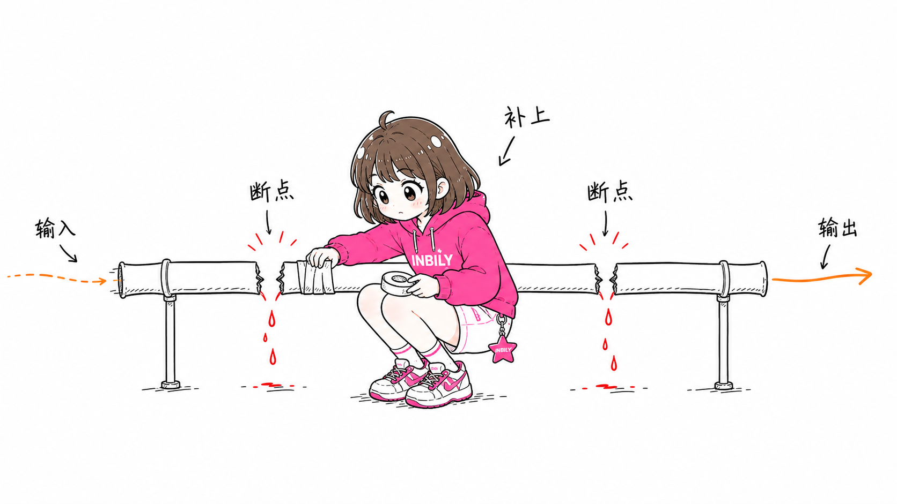

### 最小闭环


### 按用途分拣

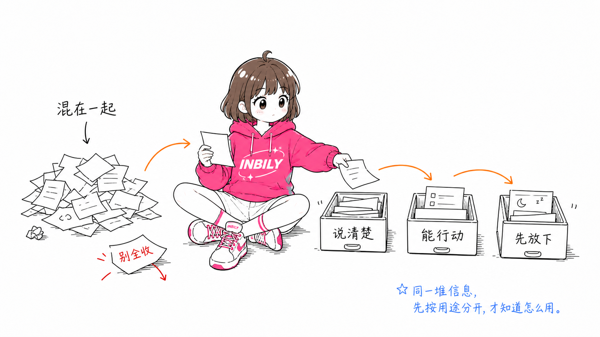

### 一份素材多种用法

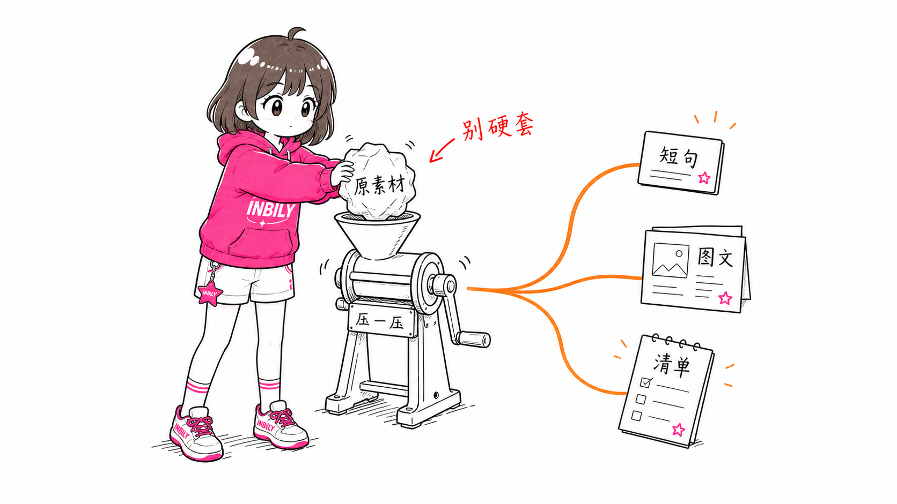

### 承接路径

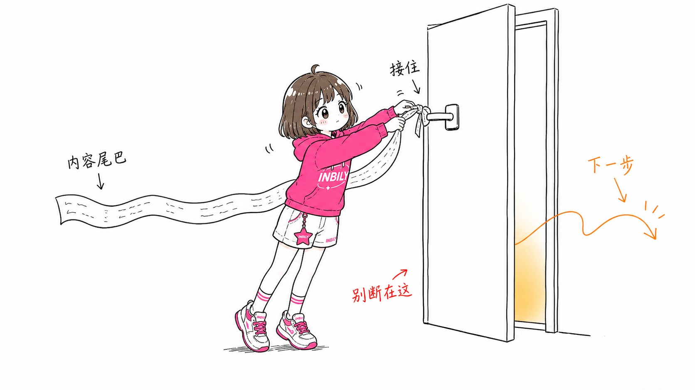

### 三个信息源

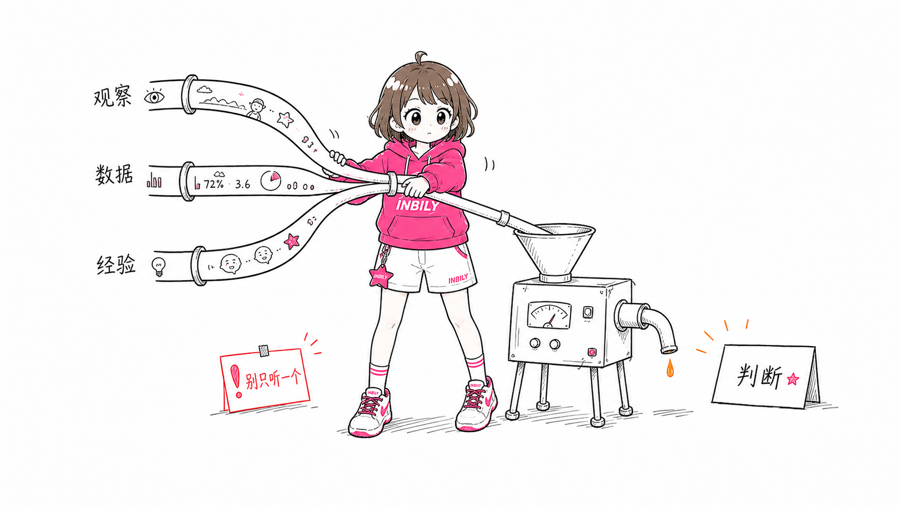

### 三种内容工作

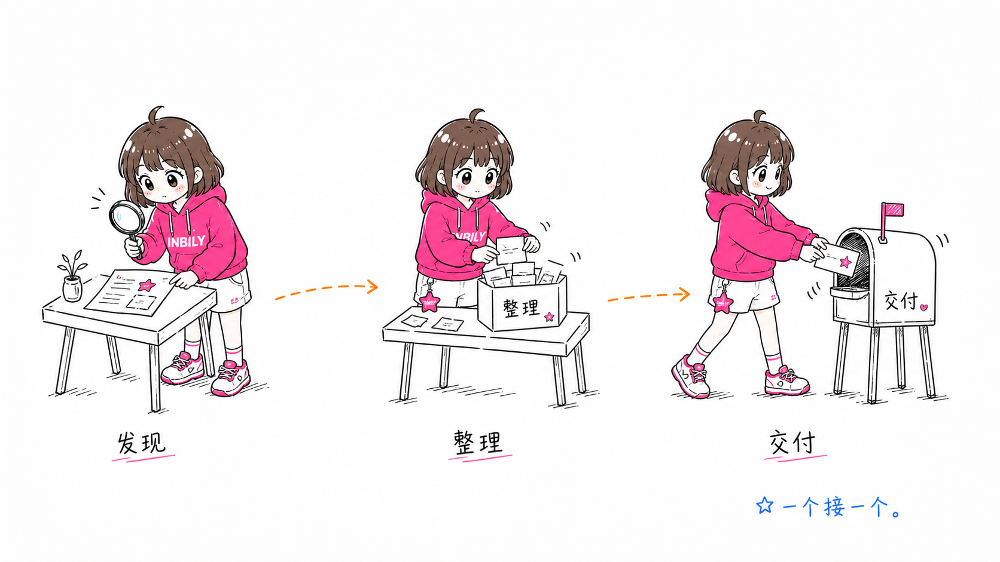

### 承接工具箱

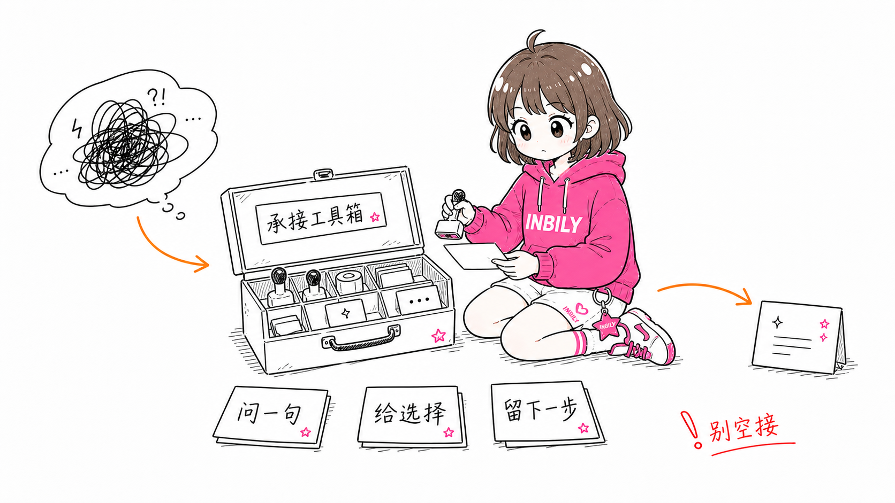

### 常见坑

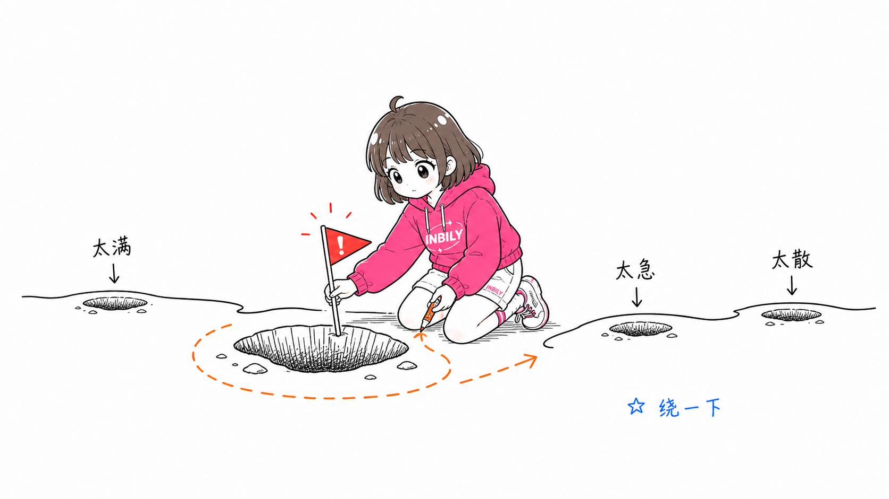

### 信息井

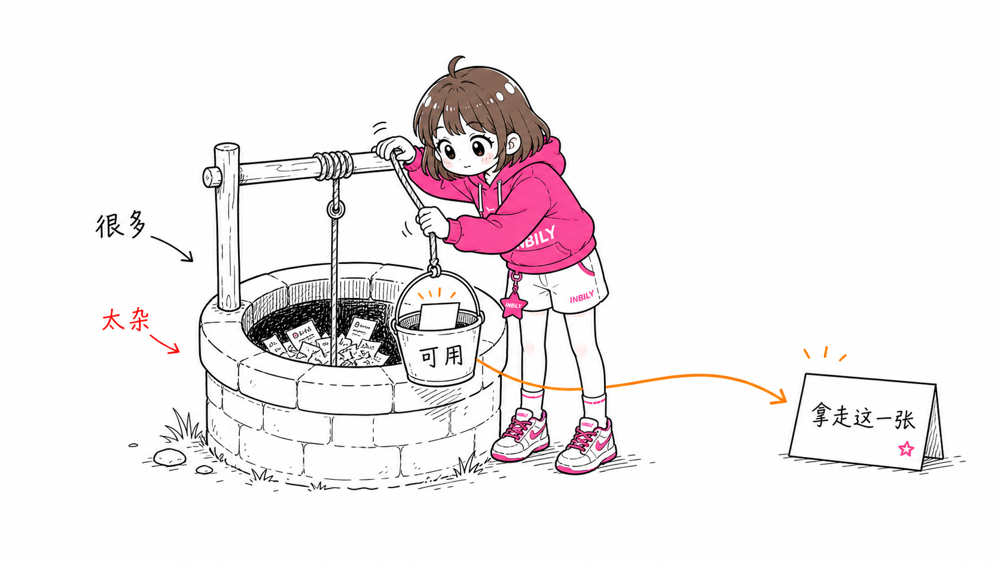

### 想法压机

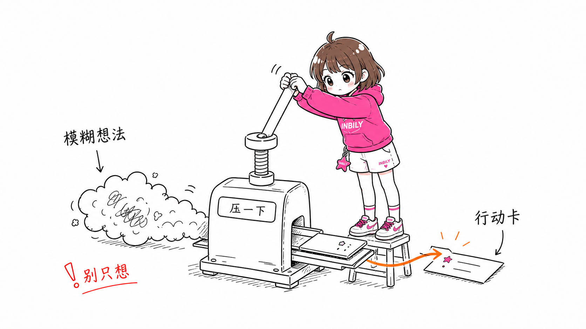

### 内容发酵

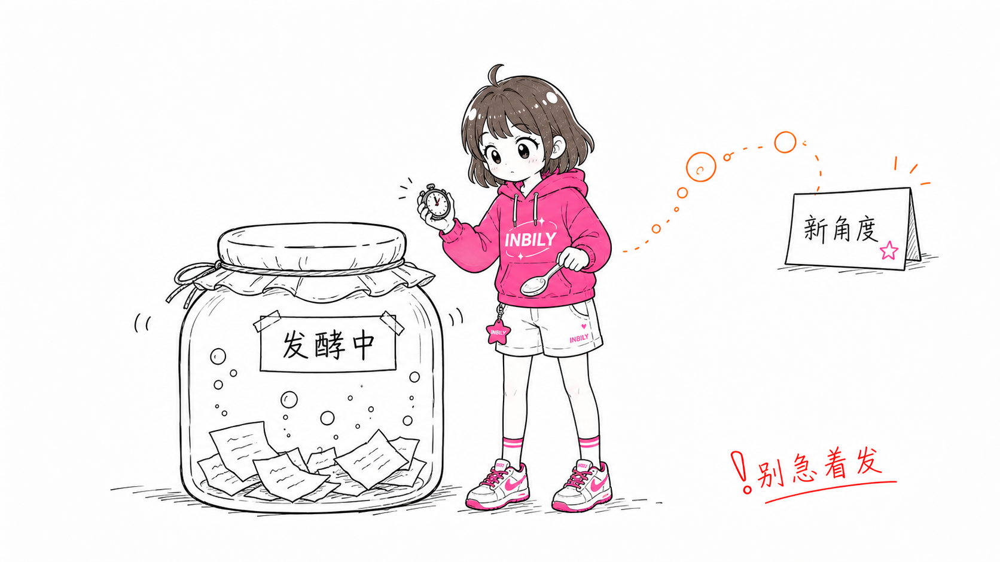

### 系统承重

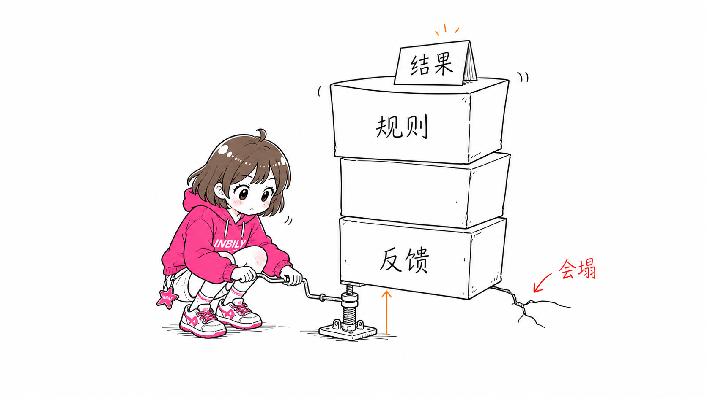

### 信任桥

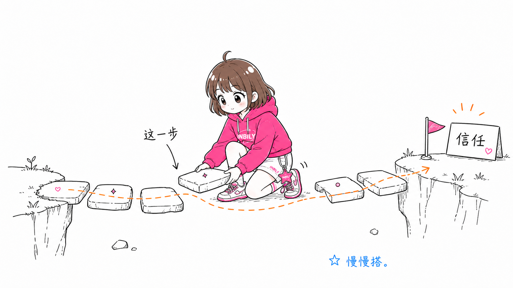

这些图片是风格校准样例，不是构图模板。使用时应该从当前文章重新发明隐喻，不要照抄示例的物件和构图。

---

## 安装

克隆仓库：

```bash
git clone https://github.com/chiehsarah/inbily-illustrations.git
cd inbily-illustrations
```

复制 skill 到 Codex skills 目录：

```bash
mkdir -p "${CODEX_HOME:-$HOME/.codex}/skills"
cp -R ./inbily-illustrations "${CODEX_HOME:-$HOME/.codex}/skills/"
```

安装后，在 Codex 里使用：

```text
Use $inbily-illustrations 为这篇中文文章设计并生成几张 INBILY 小黑风正文配图。
```

---

## 怎么用

### 只做配图规划

```text
Use $inbily-illustrations 先不要生图。
请分析下面这篇文章哪里值得配图，输出 5 张左右的 shot list。
每张图写清楚：放在哪段后、主题、核心意思、结构类型、INBILY IP 在做什么、建议元素、建议中文标注词。

<粘贴文章>
```

### 直接生成正文配图

```text
Use $inbily-illustrations 把下面这篇文章生成 4 张 INBILY 小黑风正文配图。
要求：16:9 横版、纯白背景、黑色手绘线稿、少量红橙蓝中文手写批注。
每张图只讲一个核心结构，不要做 PPT 信息图，不要品牌海报。

<粘贴文章>
```

### 为单个概念生成一张图

```text
Use $inbily-illustrations 为“信任不是喊出来的，而是一块证据一块证据铺过去”生成一张正文配图。
画面要怪诞但清爽，INBILY粉卫衣星钥少女必须承担核心动作。
中文标注最多 5 个，短一点。
```

### 去掉图里的标题或错误文字

```text
Use $inbily-illustrations 帮我编辑这张图，去掉左上角的“流程图”标题，其他内容保持不变。
```

更多示例见 [examples/prompts.md](examples/prompts.md)。

---

## 工作流程

1. 读取文章、Markdown、Notion 内容、截图或用户给的主题。
2. 提炼核心观点、认知转折、流程结构和适合视觉化的段落。
3. 先输出 shot list：每张图只选一个认知锚点。
4. 为每张图选择结构类型：Workflow、系统局部、前后对比、角色状态、概念隐喻、方法分层、地图路线或小漫画分镜。
5. 重新发明一个低科技、怪诞但成立的物理隐喻。
6. 让 INBILY IP 承担核心动作。
7. 每张图单独调用图像模型生成。
8. 按 QA checklist 检查：白底、留白、INBILY IP 动作、中文标注、非 PPT 感、非广告感、非示例复刻。
9. 保存最终 PNG，并报告用途和路径。

---

## 目录结构

```text
.
├── README.md
├── LICENSE
├── NOTICE.md
├── assets/
│   └── ian-wechat-qr.jpg
├── examples/
│   ├── images/
│   └── prompts.md
└── inbily-illustrations/
    ├── SKILL.md
    ├── agents/
    │   └── openai.yaml
    ├── assets/
    │   ├── examples/
    │   └── reference/
    │       └── inbily-ip-front.png
    └── references/
        ├── style-dna.md
        ├── inbily-ip.md
        ├── composition-patterns.md
        ├── prompt-template.md
        └── qa-checklist.md
```

真正需要安装到 Codex 的是子目录：

```text
inbily-illustrations/
```

---

## 注意事项

- 图片里的中文文字越短越稳定。
- 每张图只讲一个核心结构，不要把文章做成说明书。
- INBILY IP 必须承担核心动作；如果去掉角色画面仍然完全成立，说明角色太装饰了。
- 示例图只用于校准线条密度、留白、颜色克制和角色参与方式，不要复刻构图。
- AI 图像模型可能出现错字、幻觉标签、风格漂移或多余标题，生成后需要检查。
- 如果中文错字严重，优先减少标注词并重新生成。

---

## License

MIT License. See [LICENSE](LICENSE).

